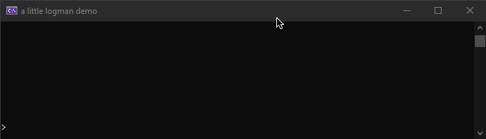

# LogMan

**LogMan** is a lightweight .NET console solution, inspired by the interactive server consoles used in Minecraft servers like *Spigot* and *Paper.* It allows multiple threads to output text to the console, without breaking any input currently being typed by a user.

## Demo - with LogMan :)

LogMan outputs text *above* your current input, like this:



## Demo - w/ default Console.ReadLine()
Without LogMan, the server's info gets *jumbled with your input.* It's unusable:


## Installation
LogMan is available as a [NuGet package.](https://www.nuget.org/packages/LogMan/)

## Usage

```csharp
using LogManager;
using System;

class Program
{
    static void Main(string[] args)
    {
        LogMan.Info("Hello world!");

        string command;
        while ((command = LogMan.ReadLine()) != "stop")
        {
            // we got a line, let's handle it!
            HandleInput(command);
        }
    }

    static void HandleInput(string text)
    {
        // dummy code!
        if (text.StartsWith("hey logman!"))
            LogMan.Info("hey back!");
    }
}
```


## License
[MIT](https://choosealicense.com/licenses/mit/)